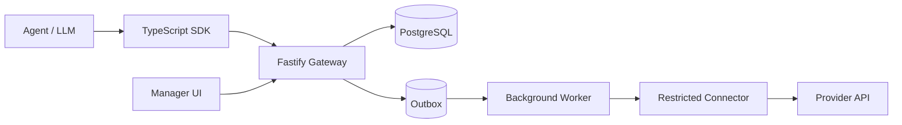
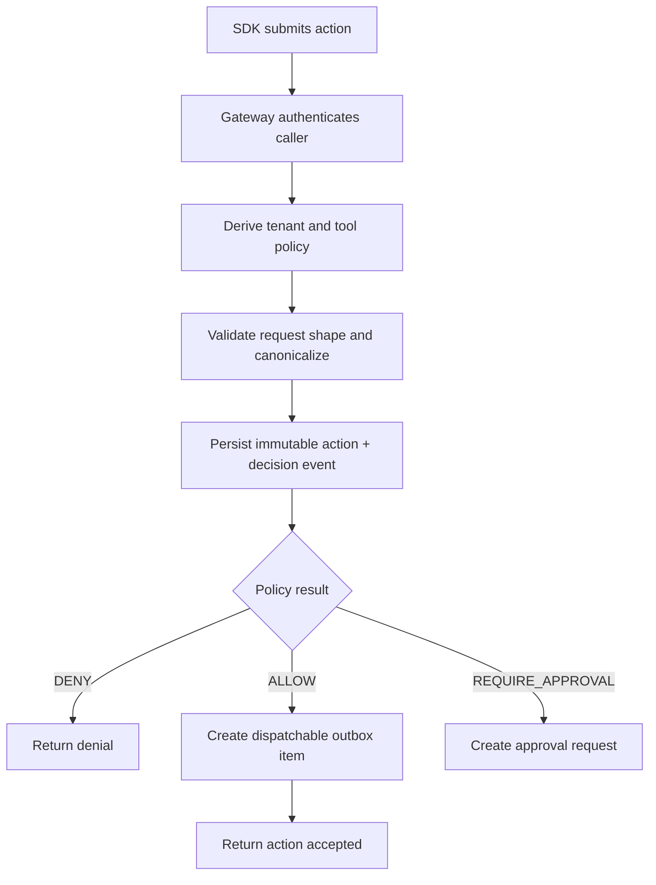
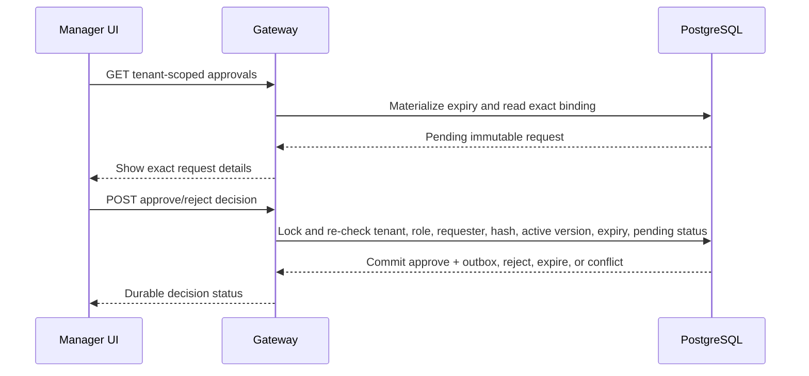
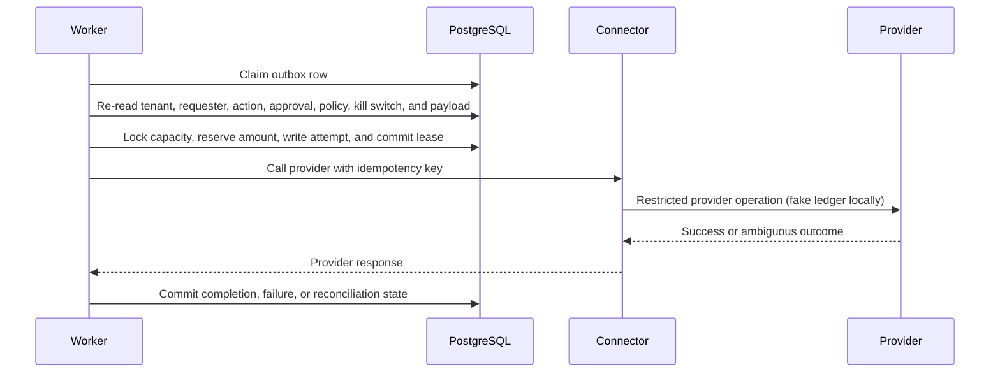

# Architecture

## System goals

The system enforces authorization outside the agent so that an LLM prompt, tool choice, or user-supplied argument cannot directly trigger side effects. The first supported business flow is a refund action with a bounded amount, explicit tenant ownership, human approval for threshold cases, and durable execution through a worker.

## Components

### Agent SDK

The TypeScript SDK is the caller-facing library used by agents or agent hosts. It packages action and approval API requests and sends them to the gateway. Callers can retrieve status through typed fetch/list methods. The SDK must not hold provider credentials or direct database access.

### Fastify gateway

The gateway is the trust boundary for inbound requests. It authenticates the caller, derives tenant identity server-side, validates payload shape, records immutable actions, evaluates policy, and emits either a denial, an approval request, or a dispatchable action.

### PostgreSQL

PostgreSQL is the system of record for actions, approvals, reservations, audit events, idempotency keys, and worker outbox rows. It is the source of truth for state transitions and concurrency control.

### Approval UI

The React dashboard is for authenticated human approvers only. It shows pending actions, the policy explanation, and the immutable request that is being approved or rejected.

### Background worker

The worker claims outbox rows, checks the current action state again, reserves capacity, calls the downstream provider through restricted credentials, and reconciles ambiguous or crashed executions.

### Restricted connector

The connector is the only component allowed to talk to the provider API. It uses credentials that are not available to the agent or SDK. The connector should be treated as a narrow, audited boundary rather than a general integration layer.

### Audit and observability

Audit events, metrics, and logs record the decision path, approval lifecycle, and execution outcomes. Audit data must be redacted so it never leaks provider secrets, raw tokens, or sensitive request payloads that are not needed for review.

## Trust boundaries

- The agent is untrusted.
- The SDK is untrusted for authorization decisions.
- The gateway is trusted to authenticate, validate, and persist state, but not to perform provider side effects.
- The worker is trusted to reconcile durable execution, but not to invent authorization.
- The provider API is external and may return ambiguous outcomes.

## Request evaluation lifecycle

The policy result is not the final side effect. Even an allow decision only means the request may be dispatched later by the worker.

The exact state names can be simplified in implementation, but the lifecycle must preserve the separation between creation, approval, dispatch, reconciliation, and terminal states. Ambiguous provider outcomes must not be modeled as a plain queued retry without an explicit reconciliation state.

Approval is bound to the exact immutable request, original policy version, tenant, and deciding manager identity. The original policy must still be active. Approval atomically queues outbox work; rejection terminates the action as denied; stale authority expires it. Editing the request requires a new action.

## Execution lifecycle

The provider call occurs outside the database transaction and only after the claim, authorization re-check, reservation, and attempt record commit. Confirmed pre-provider failures may retry with the same stable key. Ambiguous results and expired processing leases enter `pending_reconciliation`; they are never blindly retried. Reconciliation uses provider lookup to complete, fail, return confirmed non-execution safely to ready, or remain unresolved.

The tenant kill switch is checked inside the claim transaction. Once enabled it blocks new provider calls. A call already in flight may have produced an irreversible provider result, so the worker finishes or reconciles that durable attempt instead of pretending it was canceled.

The current refund policy reads a server-controlled order record. Its `orderActive` policy fact describes whether that order is active; it is not an agent-status signal. Agent and tenant suspension are enforced separately during gateway authentication/action intake and again by the worker before dispatch.

## Credential isolation and bypass prevention

Credentials stay outside the agent by design:

- The SDK never receives provider secrets.
- The agent never receives direct provider credentials.
- The gateway and worker only use server-side secrets held in the deployment environment.
- The worker uses a stable provider idempotency key so retries do not produce duplicate side effects.

Bypass prevention depends on policy, not prompt wording:

- The gateway derives tenant identity from authenticated context, not request fields.
- Request payloads are canonicalized and hashed so the exact approval target is fixed.
- Approval is invalidated by request changes, policy changes, expiry, suspension, or tenant mismatch.
- The worker re-checks authorization before dispatching, so queued work does not bypass later suspension.

## Dependency order

The implementation should be layered in this order:

1. Shared types and canonicalization.
2. Database schema and immutable action records.
3. Fastify gateway validation and policy decisions.
4. Approval state transitions.
5. Worker reservation and reconciliation.
6. SDK and React dashboard.
7. Hardening, metrics, and deployment.

## Future target architecture (not implemented)

The long-term design adds distinct identity/session infrastructure, an administrative policy control plane, a provider-neutral trusted `FactResolver`, controlled external fact connectors, one selected refund-provider sandbox, and guided organization onboarding. These are proposed Phases 6 through 10, not current runtime components. See [PRODUCT_VISION_AND_AUTHORIZATION_FLOW.md](PRODUCT_VISION_AND_AUTHORIZATION_FLOW.md) for the target experience and [IMPLEMENTATION_PLAN.md](IMPLEMENTATION_PLAN.md) for prerequisites and acceptance criteria.

Until those phases are delivered, authentication remains explicitly development-only, order facts remain PostgreSQL fixtures controlled by the server, the worker uses only its deterministic fake provider, policy authoring is not exposed, and there is no onboarding or administrative UI.
