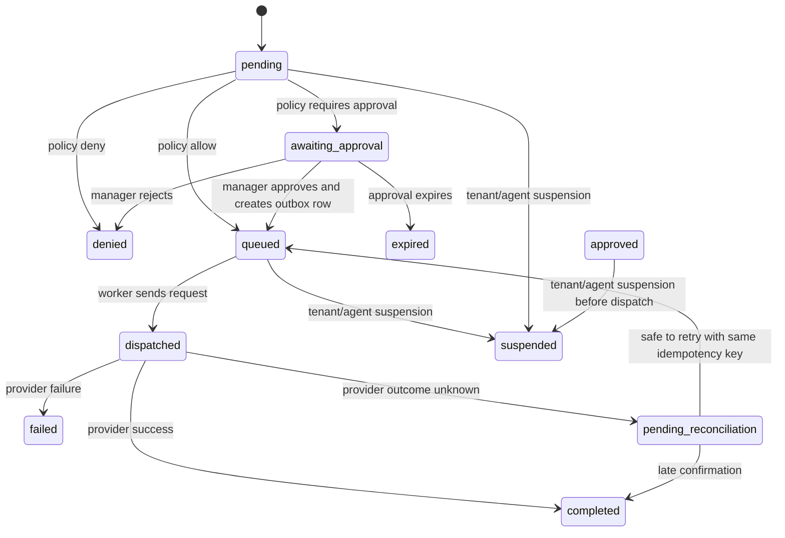

# Data and API Design

## Design principles

- Actions are immutable once created.
- The gateway derives tenant identity and roles from authentication, never from client-supplied IDs.
- Approval binds to the exact request hash and policy version.
- Execution is separate from authorization.
- Any ambiguity or missing fact defaults to denial.

## Core entities

### Tenant

Represents an isolated customer boundary.

Important fields:

- `id`: stable tenant identifier.
- `name`: display label.
- `status`: active, suspended, or deleted.
- `created_at`, `updated_at`.
- `execution_kill_switch_enabled`, reason, and update time.

Constraints:

- Tenant IDs are server-generated.
- Suspended tenants cannot create new dispatchable actions.

### Principal

Represents an authenticated subject such as an agent workload or a manager.

Important fields:

- `id`.
- `tenant_id`.
- `type`: agent, manager, admin, service.
- `status`.
- `external_subject`.

Constraints:

- Roles are server-derived.
- A principal may only act within its tenant.

### Phase 6 workload credential

Represents an expiring/revocable agent or service authentication handle. It stores a credential ID, tenant/principal binding, type, keyed HMAC verifier, state, expiry, last-use time, revocation time, and optional replacement lineage. The raw `fiar_<id>_<secret>` value is returned only by the operator CLI and is never stored.

### Human identity and session

`human_identity_mappings` binds a verified OIDC `(issuer, subject)` to an existing tenant-scoped manager/admin. `oidc_login_attempts` holds short-lived, one-use hashed state/nonce plus encrypted PKCE state. `human_sessions` stores only an opaque cookie verifier, tenant/principal binding, absolute/idle expiry, activity, and revocation. Unknown subjects and non-human principal types cannot create sessions.

### Security audit event

Authentication, credential, OIDC, and session lifecycle events use a separate table because failures may not have a known action or tenant. Payloads are event-allowlisted and cannot contain submitted token material, cookies, session identifiers, CSRF values, OIDC tokens/codes, verifiers, peppers, client/provider secrets, or credential-bearing database URLs.

### Action

Represents one immutable business request, initially scoped to the refund workflow.

Important fields:

- `id`.
- `tenant_id`.
- `principal_id`.
- `tool`: `refund.create` in the MVP.
- `request_hash`: canonical hash of the normalized request.
- `canonical_request`: normalized JSON snapshot.
- `idempotency_key`.
- `status`: pending, denied, awaiting_approval, approved, queued, dispatched, pending_reconciliation, completed, failed, expired, canceled, suspended.
- `decision_reason`.
- `policy_version`.
- `policy_version_id`.
- `policy_result`.
- `amount_minor`, `currency`.
- `order_id`.
- `order_fact_version`.
- `payment_intent_id` or provider-side equivalent.
- `created_at`, `updated_at`.

Constraints:

- Unique on `(tenant_id, idempotency_key)`.
- `request_hash` is indexed for lookup and approval binding, but it is not unique because two intentionally separate requests may have identical contents.
- Immutable canonical request after insert.
- Status transitions must be monotonic; mutations create a new action instead of rewriting the original request body.

### Policy version

Represents an immutable published policy snapshot used for decisions and approval binding.

Important fields:

- `id`.
- `tenant_id`.
- `version_number`.
- `status`: draft, published, retired.
- `ruleset` or serialized policy document.
- `published_by`.
- `published_at`.
- `created_at`.

Constraints:

- Published policy versions are immutable.
- Actions and approvals record the exact policy version they evaluated.

### Order fact record

Represents the authoritative server-side facts for the target order or refundable purchase.

Important fields:

- `id`.
- `tenant_id`.
- `external_order_id`.
- `currency`.
- `active`: whether the order itself is active and eligible for policy evaluation.
- `refundable_remaining_minor`.
- `previous_refund_total_minor`.
- `order_exposure_minor`.
- `budget_available_minor`.
- `status`: open, partially_refunded, refunded, closed, disputed.
- `source_system`.
- `source_version`.
- `updated_at`.

Constraints:

- The gateway reads authoritative order facts from this record, not from the agent.
- Reservations and committed refunds update the durable balances transactionally.
- Policy receives the order activity value as `orderActive`; an inactive order produces `ORDER_NOT_ACTIVE`. Principal and tenant suspension are separate authentication/dispatch checks.
- Multiple partial refunds are permitted while refundable remaining balance, aggregate order exposure, budget, and approval thresholds permit them. `previous_refund_total_minor` is durable execution accounting updated after confirmed success; it is not an independent current-policy denial rule.

### Payment or refund execution attempt

Represents one provider-facing attempt to carry out an approved action.

Important fields:

- `id`.
- `tenant_id`.
- `action_id`.
- `outbox_item_id`.
- `provider_name`.
- `provider_idempotency_key`.
- `attempt_number`.
- `status`: started, succeeded, confirmed failure, retryable failure, pending reconciliation, or a reconciled terminal result.
- `request_payload_redacted`.
- `response_payload_redacted`.
- `started_at`.
- `finished_at`.

Constraints:

- Every provider call gets a durable attempt record before dispatch.
- A single action may have multiple attempts, but each attempt must be uniquely traceable.
- Unknown outcomes remain associated with the attempt until reconciliation closes them.

### Approval

Represents a pending manager review in Phase 2 and, beginning in Phase 3, a manager decision on a specific action.

Important fields:

- `id`.
- `action_id`.
- `tenant_id`.
- `manager_principal_id` after a manager has reviewed it; pending requests do not require one.
- `status`: pending, approved, rejected, or expired.
- `decision`: approve or reject after a manager decision.
- `manager_comment`, `resolution_reason`, and `resolved_at`.
- `policy_version_at_decision`.
- `request_hash_at_decision`.
- `expires_at`.
- `created_at`.

Constraints:

- One active approval decision per action.
- Approval must expire.
- Approval is invalid if the request hash, tenant, policy version, or manager role no longer matches.

### Outbox item

Represents durable work waiting for the worker.

Important fields:

- `id`.
- `tenant_id`.
- `action_id`.
- `type`.
- `payload`.
- `lease_owner`.
- `lease_expires_at`.
- `status`: ready, processing, completed, retryable failure, pending reconciliation, or failed.
- `attempt_count`.
- `last_error`.

Constraints:

- Exactly one dispatchable outbox item per dispatchable action unless retry semantics intentionally re-use the same row.
- Leases must expire so crashes can be recovered.
- Retryable work is bounded by an attempt limit; ambiguous work is never returned directly to ready.

### Reservation

Represents capacity held for an action before provider dispatch.

Important fields:

- `id`.
- `tenant_id`.
- `action_id`.
- `resource_type`: order exposure, budget, or similar.
- `amount_minor`.
- `status`: reserved, released, consumed.
- `created_at`, `updated_at`.

Constraints:

- Reservation writes are transactional with the action state change that depends on them.
- Reservations cannot exceed aggregate tenant or order limits.
- Capacity is decremented when reserved, consumed after confirmed success, released only after confirmed non-execution/failure, and retained while provider outcome is unknown.

### Fake provider ledger

The development connector records one deterministic provider-side result per stable `refund:<actionId>` idempotency key. It exists only to test the connector boundary, duplicate delivery, crash recovery, and reconciliation without a network call or real monetary effect.

### Audit event

Represents a redacted trail of decision and execution events.

Important fields:

- `id`.
- `tenant_id`.
- `action_id`.
- `event_type`.
- `event_time`.
- `actor_type`.
- `redacted_payload`.
- `correlation_id`.

Constraints:

- Store only fields needed for audit and debugging.
- Redact secrets, tokens, and provider-specific credentials.

## State transitions

Suggested action lifecycle:

The exact state names can be simplified in implementation, but the lifecycle must preserve the separation between creation, approval, dispatch, and terminal states.

## API endpoints

### POST /v1/actions

Creates an immutable action request.

Authentication:

- Required.
- The caller must present an SDK or workload credential bound to a tenant.

Request fields:

- `tool`.
- `orderId`.
- `amountMinor`.
- `currency`.
- `idempotencyKey`.
- `metadata` optional, but only if explicitly allowed by schema.

Response fields:

- `actionId`.
- `status`.
- `decision`.
- `reason`.
- `approvalId` when approval is required.
- `orderId`, `amountMinor`, `currency`, `policyVersionId`, `createdAt`, and `updatedAt`.

Errors:

- `400` for invalid shape or canonicalization failure.
- `401` for missing or invalid authentication.
- `403` for wrong tenant, suspended tenant, or disallowed tool.
- `409` for idempotency hash mismatch or duplicate conflicting request.
- Policy denial is represented as a normal `201` decision response with status `denied`.

Recommendation:

- Prefer `200` or `201` with a structured decision object for policy outcomes, and reserve `4xx` for malformed or unauthorized requests.

### GET /v1/actions/:id

Returns the immutable action and its current status.

Authentication:

- Required.
- Tenant isolation applies.

Response fields are the same safe action representation returned by creation. Tenant IDs, principal IDs, request hashes, canonical request bodies, idempotency keys, and credentials are not returned.

Errors:

- `404` when the action is not visible to the tenant.

### GET /v1/actions

Lists actions for the authenticated tenant.

Query fields:

- `status` optional.
- `limit` optional, from 1 through 100; defaults to 20.
- `cursor` optional.

Results use descending `(created_at, id)` keyset order and return an opaque `nextCursor`. Unknown query fields and malformed cursors are rejected with `400`.

### GET /v1/approvals

Lists approvals visible to an authenticated manager or admin in the caller's tenant. Optional `status`, `limit`, and `cursor` fields use the same bounded keyset rules as action listing. Due, policy-stale, or requester-suspended pending approvals are transactionally materialized as expired before results are returned.

### GET /v1/approvals/:id

Returns the exact approval-bound action fields, request hash, policy version ID, timestamps, resolution fields, and a whitelist of authoritative decision facts including `orderActive`, remaining refundable balance, aggregate order exposure, and available budget. Credentials, idempotency keys, canonical request payloads, tenant/principal internals, and outbox payloads are excluded.

### POST /v1/approvals/:id/decision

Records a manager decision for an exact pending approval.

Authentication:

- Required.
- Manager or admin role required.
- Agent credentials must be rejected.

Request fields:

- `decision`: `approve` or `reject`.
- `comment` optional.
- `expectedRequestHash`: lowercase SHA-256 shown by the detail endpoint.
- `expectedPolicyVersion`: exact `policyVersionId` shown by the detail endpoint.

Response fields:

- `approvalId`.
- `actionId`.
- `decision`.
- approval and action status, resolution reason, safe comment, exact binding fields, and timestamps.

Errors:

- `401` unauthorized.
- `403` forbidden for non-managers.
- `404` if the approval is not visible to the tenant.
- `409` if the request changed, the approval expired, or the decision is no longer valid.

Approval locks the approval and action rows, rechecks active tenant/manager/requester authority and the active policy, and records the decision atomically. Approval moves the action directly to `queued` and creates one outbox row; rejection moves it to `denied` and creates no outbox work. A queued action has not executed and no funds are reserved in Phase 3.

## Phase 6 authentication and operations API

- `GET /v1/auth/oidc/start` creates one-use state/nonce/PKCE state and redirects to the configured OIDC authorization endpoint.
- `GET /v1/auth/oidc/callback` consumes state, exchanges the code, verifies the signed ID token and existing human mapping, creates a server-side session, and redirects only to the configured dashboard URI.
- `GET /v1/auth/session` authenticates the opaque cookie and returns only principal type plus a short-lived session-bound CSRF token.
- `POST /v1/auth/logout` requires session, CSRF, Origin, and Host validation; it revokes the session and clears the cookie.
- `GET /health/live` is dependency-independent process liveness.
- `GET /health/ready` returns safe required-component states and `503` when a required dependency is unavailable.
- `GET /metrics` returns bounded Prometheus metrics only after separate metrics authentication.

Production action calls accept `Authorization: Bearer fiar_<credential-id>_<random-secret>` for active agent/service credentials. Approval routes accept manager/admin sessions. Development headers remain limited to explicit development/test runtime modes. No Phase 6 route creates tenants, principals, policies, identity mappings, or credentials.

## Proposed later endpoints (not implemented)

The following illustrate the future Phase 7 administration boundary. Their exact contracts must be designed and security-reviewed before implementation.

### POST /v1/agents/:id/suspend

Suspends an agent and invalidates pending authority.

Authentication:

- Admin or tenant operator only.

Response:

- Suspended principal state plus count of affected pending and queued actions.

### POST /v1/tenant/suspend

Suspends the tenant for writes.

Authentication:

- Admin only.

Effect:

- New write attempts fail closed.
- Queued work must be revalidated before dispatch.

### POST /v1/policies

Publishes a new immutable policy version.

Authentication:

- Admin or policy editor only.

Effect:

- New requests use the new version.
- Existing approvals become invalid if the policy version is part of the approval binding.

## Error behavior

Errors should be deterministic and not reveal cross-tenant details.

- Missing authentication returns a generic unauthorized response.
- Wrong tenant behaves like not found or forbidden depending on the endpoint.
- Approval expiry is reported as a stale approval or conflict, not as a silent success.
- Ambiguous provider outcomes must be represented explicitly so retries do not create duplicates.

## Future data and integration boundaries (not implemented)

Phases 7 through 10 propose administrative models for agent/tool/resource limits and policy lifecycle; canonical fact declarations with provenance, source version, retrieval time, and maximum age; external connector health; sandbox-provider credentials and reconciliation; and onboarding state. None of those schemas, APIs, connectors, or UIs are implemented by the Phase 1–6 refund system. See [IMPLEMENTATION_PLAN.md](IMPLEMENTATION_PLAN.md) for the staged plan rather than treating this section as a current API contract.
