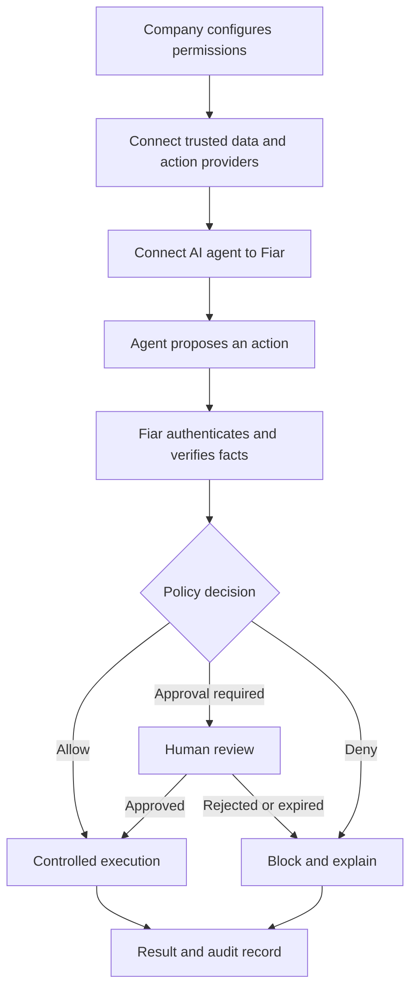
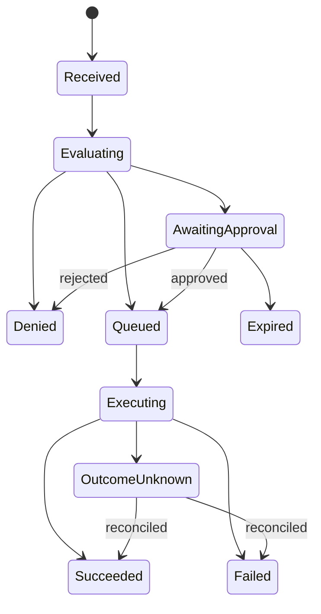

# Fiar: User-Defined Permissions and AI Agent Authorization Flow

> **Target-state document:** This document describes Fiar’s target product architecture and roadmap. For the currently implemented scope and phase status, see [IMPLEMENTATION_PLAN.md](IMPLEMENTATION_PLAN.md).

## 1. Purpose

Fiar is an authorization and execution firewall for AI agents.

Its purpose is to let a company use AI agents for useful, flexible work without giving those agents unrestricted access to consequential tools. An AI agent may decide that an action would be helpful—such as issuing a refund, sending an email, changing a database record, approving a discount, or initiating a payment—but the action must pass through Fiar before it can occur.

The core model is:

> **The AI proposes an action. Fiar independently verifies the request against the company's permissions, policies, and trusted business data. Fiar then allows, denies, or escalates the action and controls whether it is executed.**

Fiar separates two responsibilities that should not belong to the same system:

- The AI agent handles interpretation, reasoning, and choosing a useful next action.
- Fiar handles identity, authorization, fact verification, policy enforcement, approval, secure execution, and auditing.

The AI may explain why it thinks an action should happen, but Fiar does not blindly trust the AI's explanation. Where possible, Fiar retrieves the required facts from authoritative company systems and evaluates deterministic policy rules before allowing anything consequential to happen.

---

## 2. High-Level Product Experience

The intended Fiar experience has four major stages:

1. **A company configures Fiar.** A manager defines which agents exist, which actions they may request, the conditions under which those actions are allowed, and which actions require human approval.
2. **The company connects its systems.** Fiar is connected to the trusted data sources needed to evaluate policies and to the providers that perform approved actions.
3. **The AI agent is connected to Fiar.** Instead of calling consequential tools directly, the agent sends a structured action request to Fiar.
4. **Fiar authorizes and controls execution.** Fiar verifies the agent, loads trusted facts, evaluates policy, and returns an allow, deny, or approval-required decision. Approved actions are executed through a controlled path and recorded in an audit trail.



---

## 3. Stage One: The Company Configures Fiar

Before an AI agent can perform actions, an authorized company administrator or manager creates an organization or tenant in Fiar and defines its authorization boundary.

### 3.1 Create the organization

The administrator creates a Fiar workspace for the company. Fiar assigns a tenant identifier so that the company's policies, credentials, data connections, actions, approvals, and audit records remain isolated from every other customer.

Initial setup should include:

- Organization name and tenant identifier
- Authorized administrators and managers
- Environments, such as development, staging, and production
- Authentication method for human users
- Default security settings
- Data-retention and audit-retention preferences
- Emergency contacts and incident-response settings

### 3.2 Register the AI agent

The administrator registers each AI agent that will use Fiar. Each agent receives its own identity rather than sharing one unrestricted company credential.

An agent registration should describe:

- Agent name and unique principal ID
- Team or application that owns the agent
- Environment in which it operates
- Agent purpose, such as customer support or accounts payable
- Allowed tools or action types
- Scope restrictions, such as region, store, account, or department
- Spending or action limits
- Rate limits and concurrency limits
- Credential expiration and rotation policy
- Whether the agent may request actions only or may also read decision status

Example:

```yaml
agent:
  name: customer-support-agent
  principal_id: agent_support_prod_01
  environment: production
  allowed_actions:
    - refund.create
    - coupon.issue
  prohibited_actions:
    - bank_account.change
    - user.delete
  limits:
    maximum_refund_minor: 10000
    daily_refund_budget_minor: 50000
    requests_per_minute: 30
```

The credential proves which agent is making a request. It does not give the agent automatic permission to perform every action. Actual authorization is decided separately for each request.

### 3.3 Define what the company wants Fiar to protect

The administrator chooses the tools and actions that must pass through Fiar. Examples include:

- Creating or increasing a refund
- Issuing coupons or account credits
- Sending customer or employee communications
- Editing customer records
- Reading sensitive data
- Deleting records
- Changing permissions
- Deploying code
- Modifying cloud infrastructure
- Moving money
- Changing payment or bank information
- Purchasing goods or services

Each protected action should have a strict schema. For example, a refund request might require:

```json
{
  "tool": "refund.create",
  "orderId": "ord_123",
  "amountMinor": 2000,
  "currency": "USD",
  "idempotencyKey": "refund-ticket-456"
}
```

Strict schemas matter because Fiar must authorize the exact action that may later be executed. Ambiguous natural-language instructions should not be used as the final executable request.

### 3.4 Define policy rules

The administrator expresses the company's actual rules in Fiar. A policy identifies:

- Which agent or role may request the action
- Which resource the action may affect
- Which conditions must be true
- Which trusted facts are required
- Applicable amount, frequency, time, and budget limits
- Whether the action may run automatically
- When a human approval is required
- When the action must be denied

Example business rule:

> A support agent may automatically issue a refund of up to $25 only when the shipment was delivered late, the order belongs to the customer, the order has refundable value remaining, no equivalent refund has already been issued, and the team's daily budget is sufficient. Refunds from $25.01 through $100 require manager approval. Larger refunds are denied.

A corresponding conceptual policy could be:

```yaml
policy: support-refund-v1
action: refund.create
applies_to:
  principal: agent_support_prod_01

required_facts:
  - order.exists
  - order.customer_matches_request
  - shipment.delivered_late
  - order.refundable_remaining_minor
  - order.previous_refund_total_minor
  - team.refund_budget_available_minor

rules:
  - when:
      all:
        - shipment.delivered_late == true
        - order.customer_matches_request == true
        - requested_amount_minor <= order.refundable_remaining_minor
        - requested_amount_minor <= team.refund_budget_available_minor
        - requested_amount_minor <= 2500
    decision: allow

  - when:
      all:
        - shipment.delivered_late == true
        - order.customer_matches_request == true
        - requested_amount_minor <= order.refundable_remaining_minor
        - requested_amount_minor <= team.refund_budget_available_minor
        - requested_amount_minor > 2500
        - requested_amount_minor <= 10000
    decision: require_approval
    approver_role: support_manager

  - otherwise:
      decision: deny
```

This example is illustrative. Production policies should use a validated, versioned representation rather than executing arbitrary administrator-provided code.

### 3.5 Choose fail-safe defaults

Every protected action should have an explicit fallback. Fiar should deny by default when it cannot safely establish that an action is permitted.

Typical fail-closed cases include:

- The agent is not authenticated
- The agent lacks permission for the requested tool
- The request does not match the action schema
- A required business fact is missing or stale
- A connector is unavailable
- Policy evaluation fails
- The policy version cannot be resolved
- The request has expired
- The request was changed after approval
- The provider's result is uncertain

An unavailable data source must not silently turn a failed verification into permission.

---

## 4. Stage Two: Connect Trusted Company Systems

Fiar needs two categories of integrations: **fact sources** and **action providers**. The same external platform may sometimes serve both roles, but their permissions should remain distinct.

### 4.1 Fact-source connectors

Fact sources provide authoritative data used to evaluate policy. For a refund workflow, these could include:

- Order database: order ownership, value, status, and refundable balance
- Shipping provider: promised and actual delivery times
- Payment processor: previous charges and refunds
- Customer system: account status and fraud restrictions
- Budget system: remaining team or company refund budget

Fiar should retrieve these facts itself or through trusted internal services. The AI agent may supply identifiers, such as an order ID, but should not be trusted to supply decisive facts like `deliveredLate: true` when Fiar can verify them independently.

Each fact should carry provenance and freshness information:

- Source system
- Resource identifier
- Fact name and value
- Retrieval time
- Source record version or revision
- Expiration or maximum age
- Connector identity
- Integrity or signature information when available

### 4.2 Action-provider connectors

Action providers perform the actual operation after authorization. Examples include Stripe for refunds, an email service for messages, GitHub for repository changes, or a cloud provider for deployments.

Provider credentials should belong to Fiar's controlled execution service, not to the AI agent. This prevents an agent from bypassing Fiar and calling the provider directly.

Provider credentials should be:

- Scoped to the minimum required operations
- Stored in a secrets manager
- Separated by tenant and environment
- Unavailable to dashboards, browsers, SDK consumers, and model prompts
- Rotated regularly
- Audited whenever used

### 4.3 Test connections and map fields

During setup, Fiar should test each connection and map provider-specific data into canonical Fiar facts and actions. The setup UI should show the administrator which policies depend on which connectors.

For example:

| Policy requirement | Authoritative source | Canonical fact |
| --- | --- | --- |
| Shipment was late | Shipping API | `shipment.delivered_late` |
| Order belongs to customer | Order service | `order.customer_matches_request` |
| Refund remains available | Payments/order service | `order.refundable_remaining_minor` |
| No duplicate refund | Payment processor | `order.previous_refund_total_minor` |
| Budget is available | Finance service | `team.refund_budget_available_minor` |

Fiar should warn the administrator if a policy references a fact for which no trusted source is configured.

---

## 5. Stage Three: Connect the AI Agent to Fiar

The company then integrates the AI agent with Fiar using an SDK, API, gateway, proxy, or tool-server adapter.

### 5.1 The secure integration boundary

The preferred architecture is:

```text
AI model
  -> company-controlled agent runtime
  -> Fiar action API
  -> Fiar policy and execution services
  -> external provider
```

The agent runtime authenticates to Fiar with the registered agent identity. Raw production credentials should not be placed directly into the model's prompt or exposed in model-readable logs.

### 5.2 Replace direct tools with Fiar-protected tools

Instead of exposing a direct `stripe.refund()` tool to the AI, the company exposes a Fiar-protected `refund.create` tool. When the agent invokes the tool, the adapter converts the request into Fiar's strict action schema.

Unsafe path:

```text
AI agent -> payment provider -> refund occurs
```

Protected path:

```text
AI agent -> Fiar -> verify policy -> controlled provider call
```

If the agent still possesses direct provider credentials, it can bypass Fiar. Removing that bypass is essential to the security model.

### 5.3 What the AI contributes

The AI remains useful because it can handle work that is difficult to represent as a simple deterministic rule. It can:

- Read and understand a customer conversation
- Identify the relevant order
- Interpret the customer's request
- Search for supporting context
- Decide which remedy may be appropriate
- Choose a proposed action and amount
- Explain its reasoning
- Continue the conversation after the result

Fiar is not intended to replace this reasoning. It restricts the effects of that reasoning.

For a task that is completely deterministic—such as “if a shipment is late, always issue exactly $5”—a normal workflow engine may be sufficient, and AI may not be necessary. Fiar is most valuable when an AI agent has discretion but the resulting actions still need trustworthy boundaries.

---

## 6. Stage Four: The Agent Requests an Action

When the AI decides that an action may be appropriate, it submits a structured request to Fiar.

### 6.1 Request contents

A production request should contain or imply:

- Authenticated tenant and agent identity
- Action or tool name
- Target resource identifier
- Exact action parameters
- Unique idempotency key
- Request timestamp and expiration
- Optional parent workflow or conversation identifier
- Optional AI explanation or evidence references
- Trace and correlation identifiers

The AI's explanation is useful for review and auditing, but it should not override policy or substitute for trusted facts.

Example request:

```http
POST /v1/actions
Authorization: Bearer <agent-credential>
Content-Type: application/json
```

```json
{
  "tool": "refund.create",
  "orderId": "ord_123",
  "amountMinor": 2000,
  "currency": "USD",
  "idempotencyKey": "support-case-987-refund-1",
  "context": {
    "supportCaseId": "case_987",
    "reason": "Customer experienced a late delivery and requested compensation"
  }
}
```

### 6.2 Request validation

Before policy evaluation, Fiar validates:

- Authentication is valid
- Tenant and environment match
- The agent is active and not suspended
- The agent may request this action type
- The payload matches the exact schema
- Types, formats, currencies, and bounds are valid
- Unknown or dangerous fields are rejected
- The idempotency key is valid
- The request is not an invalid replay
- The request is within rate and concurrency limits

Fiar then canonicalizes the accepted request and computes a stable request hash. This hash binds later decisions and approvals to the exact action. If the amount, order, currency, or any protected field changes, the hash changes and the previous approval cannot authorize the modified request.

---

## 7. Fiar Loads Trusted Facts

After validating the request, Fiar determines which facts the active policy requires and retrieves them from configured authoritative sources.

For the refund example, Fiar may load:

```json
{
  "orderExists": true,
  "customerMatchesRequest": true,
  "deliveredLate": true,
  "refundableRemainingMinor": 15000,
  "previousRefundTotalMinor": 0,
  "budgetAvailableMinor": 45000,
  "orderFactVersion": "v18"
}
```

Important rules for fact loading:

1. **Trust authoritative sources over agent claims.** The agent may state that an order was late, but Fiar verifies that through the shipping or order system.
2. **Use minimum required data.** Fiar should load only the facts necessary for the policy.
3. **Record provenance.** The decision record should state where each decisive fact came from.
4. **Enforce freshness.** Facts older than the policy's allowed age should be refreshed or treated as unavailable.
5. **Bind mutable facts.** Fact versions used during authorization should be recorded so execution can detect important state changes.
6. **Protect sensitive fields.** Not every retrieved fact needs to be returned to the AI or shown in the dashboard.

If a required fact cannot be verified, Fiar should normally deny or escalate according to an explicit policy. It should never accept the AI's unsupported assertion merely because the trusted source is unavailable.

---

## 8. Policy Evaluation

Fiar evaluates the canonical request, authenticated identity, current policy version, and trusted facts in a deterministic policy engine.

The result should be one of three primary decisions:

### 8.1 Allow

`ALLOW` means the exact request satisfies all conditions for automatic execution.

Example:

- The agent is permitted to request refunds
- Delivery was verified as late
- The order belongs to the customer
- No duplicate refund exists
- $20 is within the refundable balance
- $20 is within the remaining budget
- The automatic-refund limit is $25

Fiar records the decision and queues the exact action for controlled execution.

### 8.2 Deny

`DENY` means the action is prohibited or required conditions were not proven.

Possible reasons include:

- Agent is not authorized for the tool
- Order does not belong to the customer
- Shipment was not late
- Requested amount exceeds refundable value
- Duplicate refund already exists
- Budget is exhausted
- Amount exceeds the maximum permitted limit
- Required fact is unavailable
- Tenant or agent is suspended
- Request appears to be a replay or policy bypass attempt

The result should include a safe, structured reason code. Internal or sensitive policy details should not be exposed unnecessarily to the AI.

### 8.3 Require human approval

`REQUIRE_APPROVAL` means the request may be valid but falls into a category that the company requires a person to review.

The approval record should be bound to:

- Tenant
- Agent identity
- Action ID
- Exact request hash
- Policy ID and version
- Relevant fact versions
- Approver role
- Creation and expiration timestamps

The approval dashboard should display the exact request, trusted business facts, policy reason, request hash, policy version, and expiration. It should make clear that approving an action authorizes the controlled execution path; it does not necessarily mean the provider operation has already completed.

---

## 9. Human Approval Flow

When approval is required:

1. Fiar stores the action as `awaiting_approval`.
2. The eligible approval appears in the correct manager's queue.
3. The manager authenticates independently of the AI agent.
4. The manager inspects the exact request and verified facts.
5. The manager approves or rejects, optionally adding a comment.
6. Fiar verifies that the approval is still pending, unexpired, and bound to the current request and policy version.
7. An approval queues the action for execution; a rejection makes it terminally denied.

Fiar must prevent:

- Self-approval by the requesting agent
- Approval by a manager from another tenant
- Approval after expiration
- Reusing one approval for another request
- Editing a request after approval
- Approving an already completed or rejected request
- Double decisions caused by repeated clicks or network retries

If an action changes, Fiar should require a new authorization decision and, if applicable, a new approval.

---

## 10. Controlled Execution

Authorization is only valuable if the agent cannot bypass it. The safest design is for Fiar—or a tightly controlled Fiar worker—to execute approved actions using provider credentials that the AI does not possess.

### 10.1 Preferred execution model

```text
Agent submits request
  -> Fiar authorizes exact request
  -> Fiar creates execution job
  -> Worker revalidates authorization
  -> Worker calls provider
  -> Worker records result
  -> Agent receives status/result
```

The worker should check before execution:

- Action is in an executable state
- Authorization or approval is valid
- Request hash still matches
- Policy and approval bindings are intact
- Action has not expired
- Idempotency has not already produced a result
- Critical mutable facts have not invalidated the decision
- Tenant and agent remain active
- Provider connector is available

### 10.2 Time-of-check versus time-of-use

Business state can change between authorization and execution. For example, another process could issue a refund after Fiar verified that none existed.

Fiar should address this through a combination of:

- Short authorization expiration windows
- Rechecking critical facts immediately before execution
- Provider-side idempotency keys
- Conditional writes or version checks
- Database transactions where possible
- Resource locking where appropriate
- Reauthorization when relevant facts change

### 10.3 Why simply returning “allowed” is weaker

Fiar could return an authorization token and let the agent call the provider, but that design is harder to secure because the provider must verify the token and ensure that the executed parameters exactly match the authorized request.

If this delegated model is used, the authorization must be short-lived, signed, audience-restricted, single-purpose, and bound to the exact request hash. The provider or trusted action proxy—not the AI—must verify it.

For the initial and safest Fiar architecture, server-side controlled execution is preferred.

---

## 11. Results Returned to the Agent

Fiar should return a structured action record rather than an ambiguous success message.

Possible states include:

- `received`
- `evaluating`
- `denied`
- `awaiting_approval`
- `approved`
- `queued`
- `executing`
- `succeeded`
- `failed`
- `expired`
- `cancelled`
- `outcome_unknown`

Examples:

### Allowed and completed

```json
{
  "actionId": "act_123",
  "decision": "allow",
  "status": "succeeded",
  "reasonCode": "POLICY_CONDITIONS_SATISFIED",
  "providerReference": "refund_789"
}
```

### Waiting for approval

```json
{
  "actionId": "act_124",
  "decision": "require_approval",
  "status": "awaiting_approval",
  "reasonCode": "REFUND_MANAGER_THRESHOLD",
  "expiresAt": "2026-09-16T17:27:00Z"
}
```

### Denied

```json
{
  "actionId": "act_125",
  "decision": "deny",
  "status": "denied",
  "reasonCode": "DELIVERY_NOT_LATE"
}
```

The AI can then continue its workflow appropriately: inform the customer, wait for approval, choose a permitted alternative, or route the case to a person. A denial should not cause the agent to repeatedly retry the same prohibited request.

---

## 12. Complete Refund Example

Assume a customer messages an AI support agent:

> “My package arrived three days late. Can I get some money back?”

### Step 1: AI reasoning

The AI reads the conversation, locates the order, determines that a $20 refund may be a reasonable resolution, and proposes `refund.create`.

This is the AI's contribution: interpreting an unstructured situation and selecting a potential response.

### Step 2: Request to Fiar

The agent sends:

```json
{
  "tool": "refund.create",
  "orderId": "ord_123",
  "amountMinor": 2000,
  "currency": "USD",
  "idempotencyKey": "case_987_refund_1"
}
```

### Step 3: Identity and schema checks

Fiar verifies that the request comes from the registered support agent, that the agent may request refunds, and that the payload is valid.

### Step 4: Independent fact verification

Fiar checks:

- The order exists
- The order belongs to the customer involved in the support case
- The promised and actual delivery dates prove that it was late
- The order has at least $20 of refundable value
- An equivalent refund has not already occurred
- The team's refund budget has at least $20 remaining

### Step 5: Policy evaluation

The policy permits automatic refunds up to $25 when all required conditions are true. Fiar returns `ALLOW` for the exact $20 request.

### Step 6: Execution

Fiar's worker rechecks critical state, calls the payment provider with a provider-side idempotency key, and records the provider result.

### Step 7: Completion

Fiar reports `succeeded` to the agent. The AI tells the customer that the $20 refund has been issued.

### Alternative outcomes

- If the AI proposes $50, Fiar may require manager approval.
- If the shipment was on time, Fiar denies the refund even if the AI claimed it was late.
- If a refund already exists, Fiar denies the duplicate.
- If the payment provider times out after receiving the request, Fiar records `outcome_unknown` and reconciles with the provider instead of blindly retrying.

---

## 13. Audit Trail and Explainability

Every authorization attempt should produce an immutable or tamper-evident audit record.

The audit trail should contain:

- Tenant and environment
- Agent identity
- Human actor identities, if involved
- Original canonical request
- Request hash
- Idempotency key
- Action timestamps and state transitions
- Policy ID and version
- Facts used, their sources, versions, and freshness
- Decision and reason codes
- Approval decision, comment, and binding
- Execution attempts
- Provider request reference and result
- Errors, retries, and reconciliation results
- Correlation and trace IDs

Sensitive data should be minimized or redacted. The audit record needs enough information to reconstruct why an action was permitted without unnecessarily storing full private conversations, secrets, or credentials.

The company should be able to answer:

- Which agent requested this action?
- What exact action did it request?
- Which policy version evaluated it?
- Which trusted facts were used?
- Why was it allowed, denied, or escalated?
- Who approved it, if anyone?
- What exactly did the provider execute?
- Did execution succeed, fail, or remain uncertain?

---

## 14. Policy Changes and Versioning

Policies must be versioned. Editing a policy should create a new immutable version rather than silently changing the meaning of past decisions.

A safe policy lifecycle includes:

1. Draft a policy.
2. Validate its schema and referenced facts.
3. Test it against example and historical requests.
4. Review the expected allow, deny, and approval rates.
5. Obtain required administrative approval.
6. Publish a version to a specific environment.
7. Monitor outcomes and exceptions.
8. Roll back to a previous version if necessary.

For higher-risk use cases, Fiar should support a shadow mode in which a new policy produces decisions without executing actions. This allows the company to compare proposed decisions with current behavior before enforcement begins.

Actions already awaiting approval need an explicit rule when policy changes. The safest default is to invalidate or reevaluate pending approvals if the applicable policy version is revoked or if the new policy materially changes the authorization boundary.

---

## 15. Security Requirements

The following are core security invariants for Fiar:

### Identity and isolation

- Every agent and human has an individual identity.
- Every request is scoped to one tenant and environment.
- Tenant data, policies, approvals, and credentials are isolated.
- Agent credentials cannot be used as manager credentials.

### Least privilege

- Agents receive permission to request only specific action types.
- Fact connectors receive read-only permissions where possible.
- Execution connectors receive only the provider permissions they require.
- Provider credentials are never exposed to the AI model.

### Exact authorization binding

- Decisions bind to the exact canonical request hash.
- Approvals bind to the request hash and policy version.
- Changed requests require new authorization.
- Expired decisions cannot be executed.

### Replay and duplication protection

- Each request uses an idempotency key.
- Repeated identical requests return the existing action or result.
- Reuse of a key with a different request is rejected.
- Provider calls also use idempotency where supported.

### Fail-closed behavior

- Missing identity, policy, facts, or connector availability does not become implicit permission.
- Unexpected states stop execution and create an observable error.
- Uncertain provider outcomes are reconciled rather than blindly retried.

### Operational control

- Administrators can suspend an agent or tenant.
- A kill switch can stop new executions.
- Credentials can be revoked and rotated.
- Rate, amount, and budget limits are enforced centrally.
- Alerts identify unusual denial, approval, retry, or spending patterns.

### Prompt-injection resistance

- Untrusted content read by the AI cannot modify Fiar policy.
- The agent cannot declare itself authorized.
- The agent cannot select the policy version used for evaluation.
- Claims embedded in emails, webpages, tickets, or documents are not treated as trusted authorization facts.
- Administrative changes require a separate authenticated control plane.

---

## 16. Recommended Fiar Components

A complete architecture can be separated into the following components:

| Component | Responsibility |
| --- | --- |
| Admin control plane | Configure tenants, agents, connectors, policies, limits, and environments |
| Agent SDK/API | Submit actions and retrieve their status without duplicating policy logic |
| Authentication service | Establish tenant, agent, manager, and administrator identities |
| Action gateway | Validate, canonicalize, hash, and persist incoming action requests |
| Fact resolver | Retrieve normalized facts from authoritative company systems |
| Policy engine | Deterministically return allow, deny, or require approval |
| Approval service | Manage exact-bound, expiring human approvals |
| Manager dashboard | Let authorized people inspect and decide approval requests |
| Execution queue | Reliably schedule approved actions |
| Worker/action proxy | Revalidate and call external providers with protected credentials |
| Audit service | Record decisions, facts, approvals, executions, and state transitions |
| Reconciliation service | Resolve timeouts and uncertain provider outcomes |
| Monitoring service | Detect failures, abnormal behavior, budget anomalies, and abuse |

These components may initially live in one codebase, but their responsibilities should remain logically separate.

---

## 17. API and State-Machine Expectations

An action should move through a controlled state machine. Example transitions:



Invalid transitions should be rejected. For example:

- A denied action cannot later be queued.
- An expired approval cannot be approved.
- A succeeded action cannot be executed again.
- A changed request cannot inherit a prior action's approval.

Useful API categories include:

- Agent action submission and status APIs
- Manager approval queue and decision APIs
- Administrator agent, connector, and policy APIs
- Internal fact-resolution and execution APIs
- Audit and reporting APIs

The agent-facing SDK should be a thin transport layer. Policy evaluation and authorization must remain server-side.

---

## 18. Onboarding Wizard Proposal

The Fiar setup experience could guide an administrator through these screens:

### Screen 1: What should Fiar protect?

Select actions such as refunds, emails, database changes, deployments, or payments.

### Screen 2: Which AI agent is requesting them?

Register the agent, owner, environment, allowed actions, and limits.

### Screen 3: What are the company's rules?

Define the conditions for automatic allowance, human approval, and denial.

### Screen 4: Where can Fiar verify those conditions?

Connect the order system, payment processor, shipping system, database, or other authoritative sources.

### Screen 5: How should approved actions execute?

Connect the provider using a narrowly scoped credential held by Fiar.

### Screen 6: Who can approve exceptions?

Assign approver roles, monetary scopes, separation-of-duty rules, and expiration windows.

### Screen 7: Test the policy

Run sample cases and show why each would be allowed, denied, or escalated.

### Screen 8: Integrate the agent

Generate environment-specific SDK or API instructions and a restricted agent credential.

### Screen 9: Start in observation mode

Record decisions without executing actions, compare outcomes, then deliberately enable enforcement and execution.

---

## 19. Current Prototype Versus Long-Term Product

The current Fiar prototype demonstrates a narrower slice of this architecture:

- An agent submits a structured refund action.
- The gateway authenticates and validates the request.
- Server-side policy evaluates refund-related facts and thresholds.
- The action can be allowed, denied, or placed into an approval queue.
- A manager dashboard displays pending approvals with their request hash and policy version.
- A manager can approve or reject the exact request.
- A worker executes approved actions through a deterministic fake provider.
- PostgreSQL records action, approval, and execution state.

The fake provider is intentional for development: it validates the control flow without moving real money.

The larger product vision adds:

- A real administrator onboarding and policy-configuration experience
- Multiple agent and human roles
- Production authentication and secret management
- Configurable, versioned policies
- Trusted fact-source connectors
- Real provider integrations
- Strong tenant and environment isolation
- Revalidation and concurrency controls
- Policy simulation and shadow mode
- Incident controls, monitoring, and reconciliation
- Additional action types beyond refunds

---

## 20. Recommended Implementation Order

The product can be expanded safely in the following order:

1. **Formalize the action contract.** Define strict schemas, canonicalization, hashes, idempotency, and state transitions.
2. **Build the agent identity layer.** Issue separate, scoped, revocable identities for agents and environments.
3. **Build the administration model.** Represent tenants, agents, roles, tools, policies, and limits.
4. **Version the policy system.** Support deterministic allow, deny, and approval decisions with reason codes.
5. **Create a fact-resolver interface.** Require source, freshness, and version metadata for every decisive fact.
6. **Add read-only fact connectors.** Start with the systems required for one well-defined workflow.
7. **Harden human approval.** Add role checks, expiration, exact binding, conflict handling, and separation of duties.
8. **Harden the execution worker.** Add revalidation, provider idempotency, retries, and outcome reconciliation.
9. **Add one real provider integration.** Use narrowly scoped credentials and a sandbox environment first.
10. **Build the onboarding UI.** Guide administrators through agents, rules, connectors, testing, and rollout.
11. **Add shadow mode and policy simulation.** Prove behavior before enabling real execution.
12. **Add operational controls.** Monitoring, alerting, kill switches, credential rotation, budgets, and incident workflows.

This order preserves the central security property: Fiar must become the mandatory enforcement point before expanding convenience features.

---

## 21. Non-Goals and Important Boundaries

Fiar should not:

- Trust the AI agent to enforce its own permissions
- Accept the agent's statement that policy conditions are true when trusted verification is available
- Put company policy logic inside each agent prompt
- Give the AI unrestricted provider credentials
- Treat natural-language reasoning as executable authorization
- Let a dashboard directly perform provider actions
- Equate manager approval with confirmed provider completion
- Retry uncertain financial operations without reconciliation
- Allow client-side SDKs to decide authorization
- Become a general AI reasoning replacement

Fiar is not responsible for deciding every business action from scratch. Its primary responsibility is ensuring that any proposed consequential action falls within a trustworthy, company-defined authorization boundary.

---

## 22. Concise Product Definition

### One-sentence definition

> **Fiar is an authorization firewall that lets AI agents propose actions while independently verifying company policy and trusted business facts before those actions can execute.**

### Short explanation

A company defines what an AI agent may attempt, the conditions that must be true, the systems Fiar should trust, and the limits that require human review. The AI sends every consequential action to Fiar. Fiar authenticates the agent, validates the exact request, retrieves authoritative facts, evaluates versioned policy, and either denies the action, requests approval, or executes it through a controlled provider connection. Every step is recorded for audit and review.

### Core principle

> **Let the AI reason, but do not let it authorize or police itself.**
